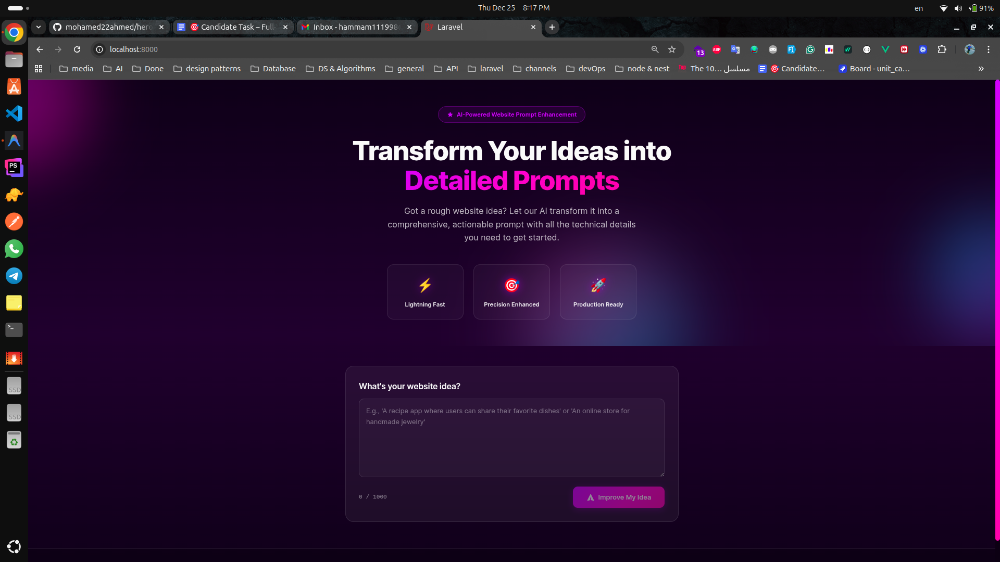
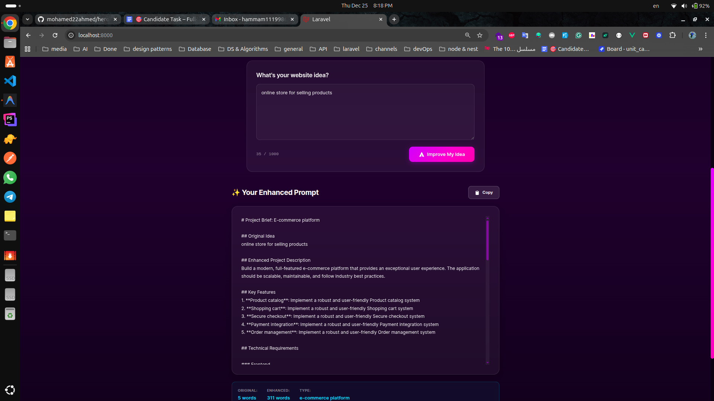

# hero_section
steps for installation:
1. clone the repository
2. run `composer install`
3. run `npm install`
4. run `npm run build`
5. run `php artisan migrate`
6. run `php artisan serve`

steps for deployment:
1. run `composer install`
2. run `npm install`
3. run `npm run build`
4. run `php artisan migrate`
5. run `php artisan serve`

Screens for the website:

#this is the result of asking for: (online store for selling products):
# Project Brief: E-commerce platform

## Original Idea
online store for selling products

## Enhanced Project Description
Build a modern, full-featured e-commerce platform that provides an exceptional user experience. The application should be scalable, maintainable, and follow industry best practices.

## Key Features
1. **Product catalog**: Implement a robust and user-friendly Product catalog system
2. **Shopping cart**: Implement a robust and user-friendly Shopping cart system
3. **Secure checkout**: Implement a robust and user-friendly Secure checkout system
4. **Payment integration**: Implement a robust and user-friendly Payment integration system
5. **Order management**: Implement a robust and user-friendly Order management system

## Technical Requirements

### Frontend
- **Framework**: Vue.js 3 with Composition API
- **Styling**: Modern CSS with Tailwind CSS or custom design system
- **State Management**: Pinia or Vuex for complex state
- **Routing**: Vue Router for SPA navigation
- **UI Components**: Reusable, accessible components

### Backend
- **Framework**: Laravel 10+ with RESTful API architecture
- **Database**: MySQL/PostgreSQL with proper indexing
- **Authentication**: Laravel Sanctum or Passport
- **Validation**: Form Request validation for all inputs
- **Testing**: PHPUnit tests for critical functionality

### Additional Technologies
- Vue.js
- Laravel
- Stripe/PayPal

## Design Guidelines
- **Aesthetic**: Modern, clean, and professional design
- **Color Scheme**: Choose a harmonious palette that reflects the brand
- **Typography**: Use readable fonts like Inter, Roboto, or similar
- **Animations**: Smooth, purposeful micro-interactions
- **Responsive**: Mobile-first approach, perfect on all devices
- **Accessibility**: WCAG 2.1 AA compliance

## User Experience
- Intuitive navigation with clear information architecture
- Fast loading times (aim for <2s initial load)
- Clear feedback for all user actions
- Error handling with helpful, user-friendly messages
- Seamless flow from landing to conversion

## Development Priorities
1. Core functionality and user flows
2. Responsive design implementation
3. Performance optimization
4. Security best practices
5. Testing and quality assurance

## Success Metrics
- User engagement and retention rates
- Page load performance scores
- Conversion rate (if applicable)
- Code quality and maintainability
- User satisfaction feedback